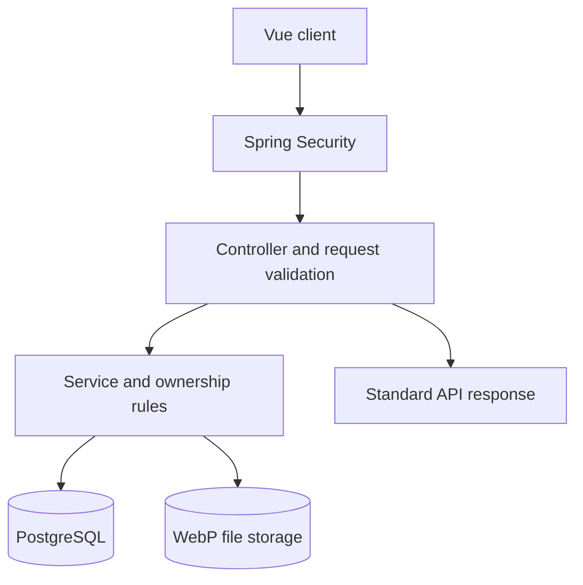

# PIMS Backend Application Flow

## 1. Overview

PIMS is a monolithic REST API for a personal inventory management system. Each
authenticated user manages only their own categories, locations, inventory
items, and item images.

The application is organized by feature (`auth`, `category`, `location`,
`inventory`, and `image`) with shared infrastructure under `common`.

## 2. Request Flow

1. The client calls an `/api/v1` endpoint and supplies the common request
   headers.
2. Spring Security allows public authentication endpoints or validates the JWT
   bearer token for protected endpoints.
3. The controller validates headers, path/query parameters, and the request
   body.
4. The service applies business rules, user ownership checks, and transaction
   boundaries.
5. JPA repositories access PostgreSQL. Image binary content is stored on the
   configured filesystem path.
6. The API returns a standard response containing the HTTP code, data, and the
   request ID in metadata. Validation and domain failures use the standard error
   response.

## 3. Authentication Flow

### Register

1. `POST /api/v1/auth/register` validates the request, including unique email
   and matching passwords.
2. The email is normalized to lowercase and the password is hashed with
   BCrypt.
3. The user is created as `ACTIVE` and receives a public `USR` code.

### Login

1. `POST /api/v1/auth/login` verifies the email, password, deletion flag, and
   active status.
2. The last-login timestamp is updated.
3. The API returns an HS256 JWT access token. Its default lifetime is 900
   seconds.
4. A random refresh token is generated. Only its SHA-256 hash is stored in
   PostgreSQL; the original value is returned as an `HttpOnly`, `SameSite=Strict`
   cookie scoped to `/api/v1/auth`. Its default lifetime is 86,400 seconds.

### Refresh, Logout, and Current User

- `POST /api/v1/auth/refresh` validates the refresh-token cookie and issues a
  new access token. The current implementation does not rotate the refresh
  token.
- `POST /api/v1/auth/logout` requires authentication, revokes the stored refresh
  token, and clears the cookie.
- `GET /api/v1/auth/me` resolves the access-token subject and returns the active
  user profile.

See the [authentication API contract](../api/AuthApi.md).

## 4. Inventory Management Flow

### Reference Data

- Categories and locations are owned by the authenticated user.
- Create, list, detail, update, and soft-delete operations are available.
- List endpoints are paginated and sorted by name.
- Inactive or deleted reference data cannot be assigned to an inventory item.

### Inventory Items

1. The user creates an item using one active category and an optional active
   location belonging to the same user.
2. New items start with status `OWNED`.
3. The list endpoint supports pagination, filtering, and sorting.
4. Detail and update operations always query by both item code and current-user
   code, preventing cross-user access.
5. Deleting an item marks it as deleted and also marks its images as deleted.
   Physical image files are removed after the database transaction commits.

### Item Images

1. Images can be uploaded only for an inventory item owned by the current user.
2. The API accepts only a valid WebP file with content type `image/webp` and a
   maximum size of 100,000 bytes.
3. An item can contain at most five active images.
4. The first image becomes primary. Image lists return the primary image first,
   followed by creation date.
5. Deleting a primary image promotes the oldest remaining image.
6. Image content and delete operations also verify ownership through the parent
   inventory item.

See the [inventory](../api/InventoryApi.md),
[category](../api/CategoryApi.md), [location](../api/LocationApi.md), and
[image](../api/ImageApi.md) API contracts.

## 5. Data and Identifier Conventions

- Every entity extends `BaseEntity`, which provides the internal TSID `id`,
  audit timestamps, audit users, optimistic-lock version, and soft-delete flag.
- Internal numeric IDs are backend/database concerns and are not exposed to the
  frontend.
- Public codes such as `USR000001`, `CAT000001`, `LOC000001`, `ITM000001`, and
  `IMG000001` are generated from PostgreSQL sequences.
- Domain relations use public code columns rather than database foreign keys.
  Services validate existence, active status, and ownership before saving.
- Flyway owns the schema through
  `src/main/resources/db/migration/V1__create_initial_schema.sql`.
- The schema includes `inventory_activity_records` for future audit history,
  but no activity API is implemented in the current assignment scope.

See the [entity relationship diagram](pims-erd.jpg).

## 6. Common API Conventions

All application requests use:

- `X-CHANNEL-ID` — required request channel.
- `X-SERVICE-ID` — required caller identifier.
- `X-REQUEST-ID` — optional correlation ID; generated when omitted.
- `Authorization: Bearer <access-token>` — required except for public auth
  endpoints.

List endpoints return `content`, `page`, `size`, `totalElements`, `totalPages`,
`first`, and `last`. Page numbers are zero-based and page size is limited to 50.

Swagger UI is available at `/swagger-ui.html` while the application is running.

## 7. Current Scope

The implemented assignment scope covers authentication, per-user category and
location management, inventory CRUD with filters and pagination, and WebP image
management. Production concerns that require further design are documented in
the project disclaimer in the root [README](../../README.md).
